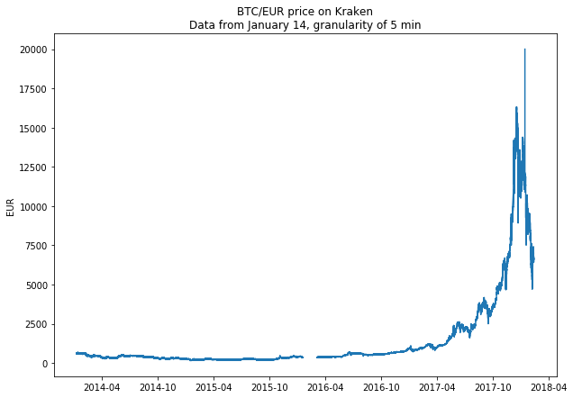

# Bitcoin’s tick-by-tick data analysis

## Introduction
The purpose of this article is to analyse Bitcoin tick-by-tick data [available here](http://api.bitcoincharts.com/v1/csv/). We will focus exclusively on BTC/EUR data from Kraken exchange. This choice is a bit arbitrary but Kraken seems to be one of the most active exchanges for EUR. The file contains 16.7 million BTC/EUR transactions, with the corresponding timestamp and volume. There are indeed three columns: the POSIX timestamp, the price (in EUR) and the volume (in BTC). The first 10 lines of the csv file look like that: 

   | timestamp |     price   | volume|
   |-----------|:-----------:|-------|
   |1389173189 |624.01000    |0.20000|
   |1389173198 |624.01000    |0.09767|
   |1389173198 |623.53836    |0.01358|
   |1389173265 |623.53836    |0.14896|
   |1389173339 |623.54066    |0.20000|
   |1389173528 |623.54066    |0.17630|
   |1389173534 |623.54065    |0.40633|
   |1389173545 |623.53846    |0.20000|
   |1389173545 |623.53836    |1.80000|
   |1389173668 |623.53836    |0.12370|
   
   ## What's the plan?
   We will try to explore this dataset and analyse the statistical properties of BTC prices. In particular, we will try to model the properties of this time series at different time scales. Nonetheless, we will limit our approach to short time scales given that Bitcoin is a very young asset. Following what can be found in [^fn1] concerning S&P500, GBP/USD and German bunds, we will discuss second order statistics, the distribution of returns over different time scales.
   
   

   
   
   
   
   
   
## References

[^fn1]: Jean-Philippe Bouchaud, Marc Potters. Theory of Financial Risk and Derivative Pricing: From Statistical Physics to Risk Management. 2004.
