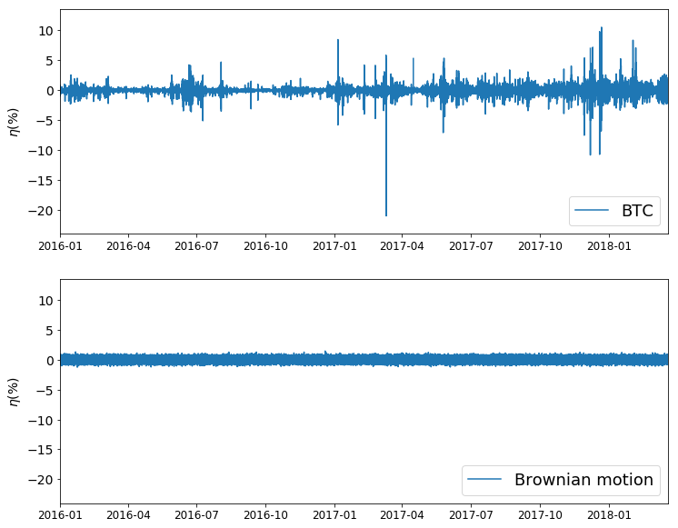
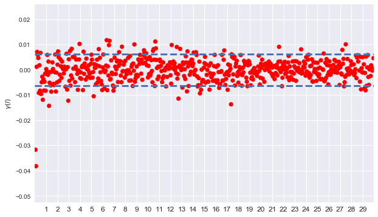
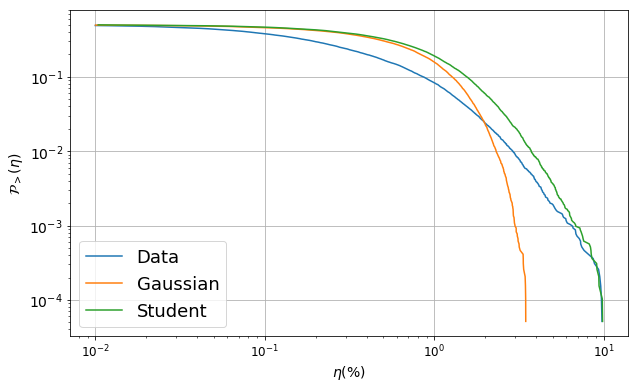

<script src="https://cdn.mathjax.org/mathjax/latest/MathJax.js?config=TeX-AMS-MML_HTMLorMML" type="text/javascript"></script>

# Bitcoin’s tick-by-tick data analysis

## Introduction
The purpose of this article is to analyse Bitcoin tick-by-tick data [available here](http://api.bitcoincharts.com/v1/csv/). We will focus exclusively on BTC/USD data from Coinbase exchange. This choice is a bit arbitrary but Coinbase seems to be one of the most active exchanges for USD, behind bitmex, and the CSV file covers a long period of time. As of March 2018, the file contains 39 million BTC/USD transactions, with the corresponding timestamp and volume. There are indeed three columns: the POSIX timestamp, the price (in USD) and the volume (in BTC). The first 10 lines of the csv file look like that: 

   | timestamp |     price   | volume|
   |-----------|:-----------:|-------|
   |1417412036 |300          |0.010000|
   |1417412423 |300          |0.010000|
   |1417415048 |370          |0.010000|
   |1417416612 |370          |0.026556|
   |1417498166 |377          |0.010000|
   |1417517949 |377.75       |0.250000|
   |1417517949 |378          |3.750000|
   |1417518257 |378          |4.900000|
   |1417518340 |378          |5.200000|
   |1417545780 |378          |0.010000|

## What's the plan?
We will try to explore this dataset and analyse the statistical properties of BTC prices. In particular, we will try to model the properties of this time series at different time scales. Nonetheless, we will limit our approach to short time scales given that Bitcoin is a very young asset. Following what can be found in [^fn1] concerning S&P500, GBP/USD and German bunds, we will discuss second order statistics and the distribution of returns over different time scales.
      
## Data cleaning
Before investigating the statistical properties of this dataset, it seems necessary to perform some basic data cleaning tasks. First, Pandas library includes some tools to deal with dates and create statistics based on a given window size.
Let's first read the csv file and convert the timestamps into dates:
```python
import pandas as pd

data = pd.read_csv('coinbaseUSD.csv', header=None, names=['timestamp', 'price', 'volume'])
data['timestamp'] = pd.to_datetime(data['timestamp'], unit='s')
```
Finally, pandas includes a tool to compute open/high/low/close features on specific windows. We will work on windows of 5 minutes. We will also store the number of transactions for each 5 minute period.
```python
prices = data['price']
prices.index = data['timestamp']
ts = prices.resample('5Min').ohlc()
ts['n_transctions'] = prices.resample('5Min').count()
```
We obtain the following time series (for the first 10 rows): 
                      
|timestamp            |  open |  high |  low  | close |  n_transactions |
|-------------------- |:-----:|-------|-------|-------|:---------------:|
|2014-12-01 05:30:00  | 300.0 | 300.0 | 300.0 | 300.0 |      1          |
|2014-12-01 05:35:00  |  NaN  |  NaN  | NaN   |  NaN  |      0          |
|2014-12-01 05:40:00  | 300.0 | 300.0 | 300.0 |  300.0|      1          |              
|2014-12-01 05:45:00  |  NaN  |  NaN  |  NaN  |  NaN  |      0          |              
|2014-12-01 05:50:00  |  NaN  |  NaN  |  NaN  |  NaN  |      0          |  
|2014-12-01 05:55:00  |  NaN  |  NaN  |  NaN  |  NaN  |      0          |
|2014-12-01 06:00:00  |  NaN  |  NaN  |  NaN  |  NaN  |      0          |
|2014-12-01 06:05:00  |  NaN  |  NaN  |  NaN  |  NaN  |      0          |
|2014-12-01 06:10:00  |  NaN  |  NaN  |  NaN  |  NaN  |      0          |
|2014-12-01 06:15:00  |  NaN  |  NaN  |  NaN  |  NaN  |      0          |
 
Note that some windows of 5 minutes do not contain any transaction. It might be the case in periods of time when BTC was less liquid than today (back in 2014 for example), or in situations of trading halts (specific Coinbase issues for instance).

The next step is to compute the log-returns over each window: 
```python
ts['return'] = np.log(ts['close']) - np.log(ts['open'])
```
Since the first rows of the dataset do not contain many transactions, we give the log-returns of the last 5 lines using ```ts.tail(5)```:

|timestamp           |  open   |   high  |   low   |  close  |n_transactions |  return | 
|--------------------|:-------:|---------|---------|---------|:-------------:|---------|
|2018-03-21 11:30:00 | 9103.50 | 9103.50 | 9103.49 | 9103.50 |       75      |0.000000 |
|2018-03-21 11:35:00 | 9103.49 | 9110.99 | 9103.49 | 9110.99 |       126     |0.000824 |
|2018-03-21 11:40:00 | 9110.98 | 9117.00 | 9110.98 | 9117.00 |       148     |0.000661 |
|2018-03-21 11:45:00 | 9117.00 | 9117.00 | 9092.27 | 9092.28 |       214     |-0.002715|
|2018-03-21 11:50:00 | 9092.27 | 9092.28 | 9072.18 | 9072.20 |       182     |-0.002210|

### What happened April, 15 2017 ?

Looking at the returns, one can clearly spot some anomalies. In particular, April 15 2017 at 11 pm, BTC moved from USD 0.06 to USD 1181.95 as Coinbase reopened after a planned maintenance. This corresponds to a return of 989% and clearly indicates that some returns in this dataset are not representative of the evolution of BTC but have more to do with computer failures. For statistical analysis of BTC/USD returns distribution, these rows should be removed from the dataset. That's what we do next line: 

```python
ts.drop(pd.to_datetime('2017-04-15 23:00:00'), inplace=True)
```

More generally, whe should only focus on the last years since at inception BTC was far from being liquid. Completely arbitrarily, we consider only the data **since January 1, 2016**. This new dataset contains about 34 million transactions.

```python
start = pd.to_datetime('2016-01-01 00:00:00')
ts = ts.loc[start:]
```
We can compute the average number of transactions per second since January 1, 2016 with these lines of code:
```python
trans_per_sec = ts['n_transactions'].mean() / (5 * 60)
```
which gives 0.48 transaction per second. BTC/USD is not liquid at all...but it's not suprising.

## Heteroskedasticity

It is often assumed in time series analysis that a specific distribution does not change with time. Nonetheless, it is a well-known fact in finance that the variance of the returns is time dependent: some calm periods succeed to more turbulent ones. This fact called **heteroskedasticity** is clearly observable when plotting the 5 minutes returns of BTC against random shocks of the same order of magnitude, as a Brownian motion would have generated. Note that this is not BTC specific: other financial assets exhibit periods of calm succeeding more turbulent ones (for example 1929, 1987, 2008 for equity).



Some periods of high volatility (SEC rejection of Winklevoss brothers' ETF project in March 2017, bubble burst in December 2017) alternate with calmer periods. On the contrary, the random returns generated by a geometric Brownian motion exhibit a featureless pattern. $$S$$ is said to follow a geometric Brownian motion if it satisfies the following stochastic differential equation:

  $$\frac{\mathrm{d}S_t}{S_t} = \mu  \mathrm{d}t + \sigma \mathrm{d}B_t $$ 
 
This model states that the returns are composed of a deterministic component (the drift $$\mu$$) plus some gaussian noise, represented by the increments of the Brownian motion. In this model, $$\sigma$$ and $$\mu$$ are assumed to be constant. For a small time step $$\delta t $$, say 5 minutes,  

  $$\frac{\delta S}{S} = \mu \delta t + \sigma \sqrt{t} Z $$ 

where $$Z \sim \mathcal{N}(0,1) $$
This model at the heart of Black and Scholes assumtions leads to normally distributed returns and log-normal prices. The returns over 5 minutes are normally distributed with mean $$\mu \delta t $$ and variance $$\sigma^2 \delta t$$ which is not consistent with empirical data: December 2017, some 35$$\sigma$$ events were observed (see [this paper](https://arxiv.org/ftp/arxiv/papers/1103/1103.5672.pdf) for further development).

The chart above was created with the following lines of code: 
```python
vol = ts['return'].std()
shocks = np.random.normal(loc=0.0, scale=vol, size=len(ts))

plt.figure(1, figsize=(12, 10))

plt.subplot(211)
plt.plot(ts.index, 100*ts['return'], label='BTC')
plt.xlim(ts.index[0], ts.index[-1])
plt.ylim(100*ts['return'].min() - 3, 100*ts['return'].max() + 3)
plt.ylabel(r'$\eta(\%)$')
plt.legend(loc=4, prop={'size': 18})

plt.subplot(212)
plt.plot(ts.index, 100*shocks, label='Brownian motion')
plt.xlim(ts.index[0], ts.index[-1])
plt.ylim(100*ts['return'].min() - 3, 100*ts['return'].max() + 3)
plt.ylabel(r'$\eta(\%)$')
plt.legend(loc=4, prop={'size': 18})

plt.show()
```
## Autocorrelations
We now investigate the serial dependence between the returns. We compute the partial autocorrelation function on the returns with lags ranging from 5 minutes to 30 hours. The graph below shows the partial ACF and the $$-3/\sqrt{N}, + 3/\sqrt{N}$$ confidence interval. We observe some significant negative autocorrelations in the first hour. Nontheless, given the high amount of transaction fees on BTC exchanges, there is no garantee on the profitability of this correlations. Some significant positive correlations exist between 3 and 15 hours, perhaps because of trend-following strategies.



This graph was produced by the following piece of code:

```python
# First, we center and scale the data to treat nan as zeros
ret = ts['return']
ret = (ret - ret.mean())/ret.std()

# We compute the confidence interval
n = len(ret)
conf_int = [-3/np.sqrt(n),  3/np.sqrt(n)]

# We compute the ACF
auto_c = []
vec_lag = list(range(1, 600))
for lag in vec_lag:
    ac = ret.fillna(0).autocorr(lag=lag)
    auto_c.append(ac)

plt.rc('font', size=14)
plt.rc('xtick', labelsize=12)
plt.figure(figsize=(10, 6))
plt.scatter(vec_lag, auto_c, marker='o', linestyle='--', color='r')
plt.xlim(vec_lag[0]- 1, vec_lag[-1] + 1)
plt.ylabel(r'$\gamma(l)$')
plt.axhline(y=conf_int[0], linestyle='--', linewidth=3.0 )
plt.axhline(y=conf_int[1], linestyle='--', linewidth=3.0)
plt.xticks([v for v in vec_lag if (v % 20 == 0) ],
            [ int(v/20) for v in vec_lag if (v % 20 == 0)])
plt.show()
```
## Cummulative distribution of returns
In this section, we examine the tail of the distribution of returns and compare it with the Gaussian and Student cases. We will see that the decay of the empirical distribution is much slower than what expected with a Gaussian random variable. We compute the returns on periods of one hour. Indeed, the ACF detailed previously is not incompatible with the scenario where returns are independent, except for a lag shorter than one hour. We neglect the autocorrelations that appeared after this lag which are less significant. Under this scenario, by addition of random variables, the distribution on longer time scales should be the convolution of distributions on shorter time scales.

First, we regroup the data as we did before, but with periods of one hour:
```python
ts = prices.resample('1H').ohlc()
ts['n_transactions'] = prices.resample('5Min').count()
ts['return'] = np.log(ts['close']) - np.log(ts['open'])
ts['return'].loc[pd.to_datetime('2017-04-15 23:00:00')] = np.nan
start = pd.to_datetime('2016-01-01 00:00:00')
ts = ts.loc[start:]
```
Then, we center and normalize the returns. We can therefore handle the missing values as zeros.
```python
ret = ts['return']
ret = (ret - ret.mean())/ret.std()
ret.fillna(0, inplace=True)
```
Finally, we simulate normal random variables:
```python
norm = np.random.normal(size=len(ret))
```
We the define a function to compute the cummulative distribution given a sample. 
```python
def compute_cdf(sample, thresh=1e-2):
    N = len(sample)
    x = np.sort(sample)
    cdf = np.array(range(N))/float(N)
    cdf = 1 - cdf
    x = x[x > thresh]
    cdf = cdf[-len(x):]
    return x, cdf
```
We apply this function to the returns and to the sample ```norm``` created before. We then plot the associated tails of the cdf in a log-log chart.
```python
x1, cdf1 = compute_cdf(ret)
x2, cdf2 = compute_cdf(norm)

plt.rc('font', size=14)
plt.rc('xtick', labelsize=12)
plt.figure(figsize=(10, 6))
plt.xlabel(r'$\eta(\%)$')
plt.ylabel(r'$\mathcal{P}_>(\eta)$')
plt.loglog(x1, cdf1, basex=10, label='Data')
plt.loglog(x2, cdf2, basex=10, label='Gaussian')
plt.legend(loc=3, prop={'size': 18})
plt.grid(True)
```
This gives the following graph:




## References

[^fn1]: Jean-Philippe Bouchaud, Marc Potters. Theory of Financial Risk and Derivative Pricing: From Statistical Physics to Risk Management. 2004.
