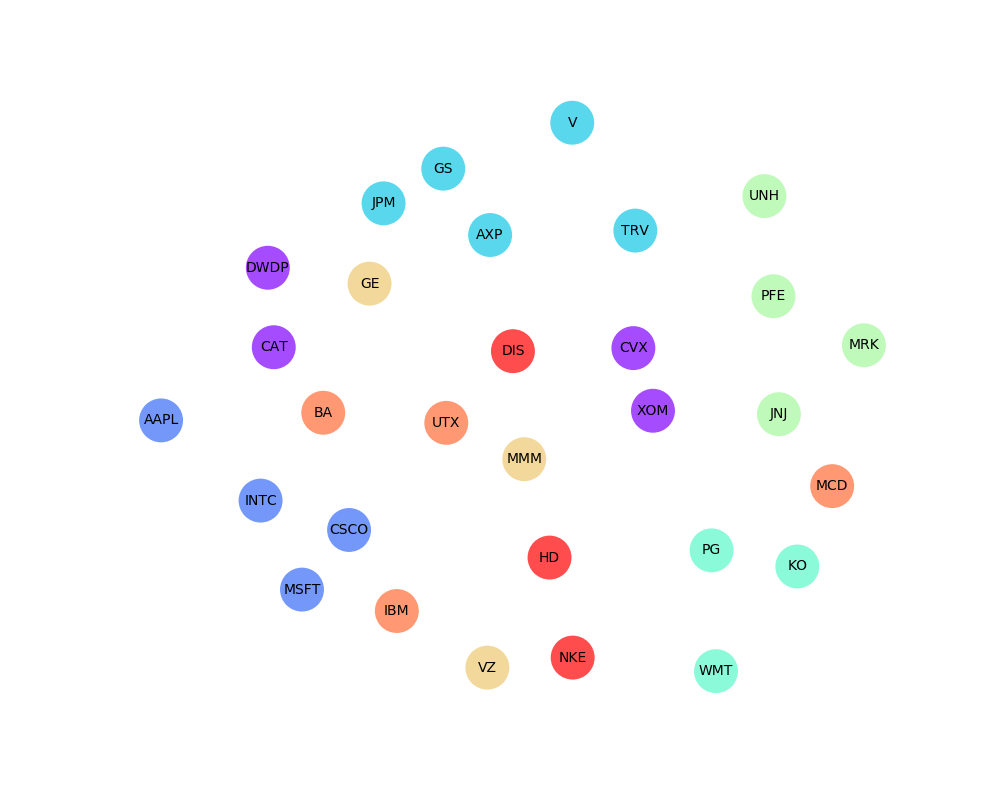

<script src="https://cdn.mathjax.org/mathjax/latest/MathJax.js?config=TeX-AMS-MML_HTMLorMML" type="text/javascript"></script> 

# Taxonomy of the Dow Jones Industrial Average [2/2]: the Multi-Dimensional Scaling case

This article completes the short study described here, in which the correlation matrix of 30 US stocks is computed and analysed
in terms its associated minimum spanning tree. This approach revealed economic sectors, by linking together stocks presenting strong correlations.
In this article, we propose to extend this study using multi-dimensional scaling instead of a minimum spanning tree. First, let's define what MDS means.

Multi-dimensional scaling seeks a mapping from a space $$S$$ with a distance $$d$$ to an Euclidian space of dimension $$n$$, so that pairwise distances are preserved. In our case, each point of $$S$$ is a stock and $$d$$ is the distance defined from the correlation matrix introduced in the first part $$d_{ij} = \sqrt{2(1 - \rho_{ij})}$$. The objective of this approach is to map the 30 stocks into a 2D (or 3D) space while preserving distances. As a result, this mapping would allow us to distribute the stocks according to their pairwise correlations, so that close points in the 2D space are highly correlated stocks and conversely, points far from each other are stocks with a low correlation.

More precisely, the mapping is obtained by minimising the objective function $$\Biggl(\sum_{i\ne j=1,...,N}\bigl(d_{ij}-\|x_i-x_j\|\bigr)^2\Biggr)^{1/2}$$.

Let's write some Python code to find this mapping:

```python
from sklearn import manifold

# sectors obtained from the MST of the first part
sectors = {'CAT': 0, 'XOM': 0, 'CVX': 0, 'DWDP': 0,
           'CSCO': 1, 'MSFT': 1, 'INTC': 1, 'AAPL': 1,
           'V': 2, 'AXP': 2, 'GS': 2, 'JPM': 2, 'TRV': 2,
           'KO': 3, 'PG': 3, 'WMT': 3,
           'MRK': 4, 'PFE': 4, 'UNH': 4, 'JNJ': 4,
           'GE': 5, 'MMM': 5, 'VZ': 5,
           'BA': 6, 'MCD': 6, 'UTX': 6, 'IBM': 6,
           'DIS': 7, 'HD': 7, 'NKE': 7}
           
# list of colours associated to a ticker, given its sector
list_sect = [sectors[ticker] for  ticker in dist_matrix.columns]

seed = np.random.RandomState(seed=2)
mds = manifold.MDS(n_components=2, max_iter=3000, eps=1e-9, random_state=seed,
                   dissimilarity="precomputed", n_jobs=1)
pos = mds.fit(dist_matrix).embedding_
```
The variable ```pos``` is 30 by 30 ```numpy array```, so that ```pos[i,0]``` and ```pos[i,1]``` are the coordinates of stock $$i$$ in the euclidean space.

We can now plot each stock at his position in the 2D Eucliden space:
```python
plt.figure(figsize=(10,10))
plt.axis('off')
plt.scatter(pos[:, 0], pos[:, 1],  s=1000, alpha=0.7, lw=0,
            c=list_sect, cmap='rainbow')

for label, x, y in zip(dist_matrix.columns, pos[:, 0], pos[:, 1]):
    plt.annotate(
        label,
        xy=(x, y), xytext=(0, 0),
        textcoords='offset points', ha='center', va='center',
        )
plt.show()
```
We obtained the follogin result:



Note that each stock is coloured according to its position in the MST defined in the first part. We can see how the clusters of the first part are preserved, stocks belonging to the same sector are correctly maped in regions where they are close from each other. We also observe the same centrality of MMM as in the MST. The significant diversity of 3M activities explains this centrality, the company beeing exposed to a broad range of economic sectors.

