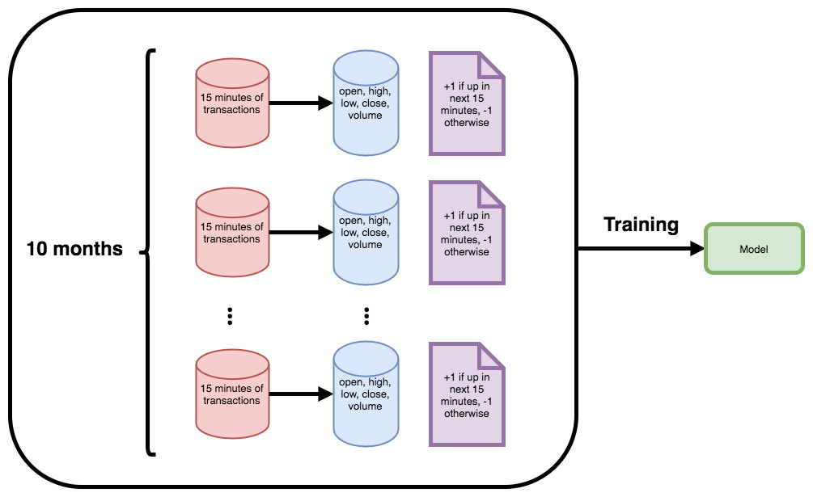
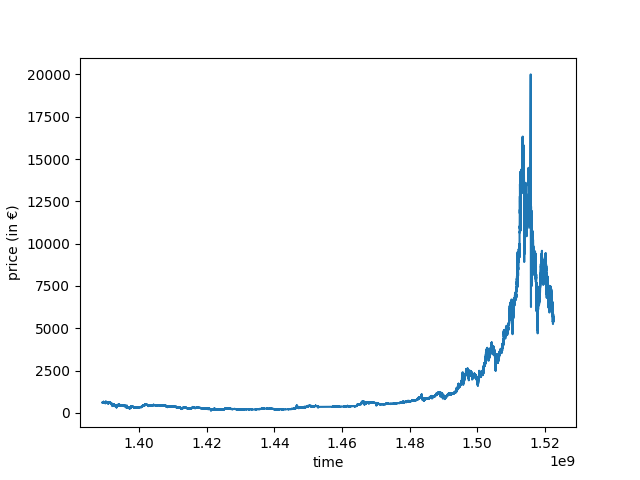

# Bitcoin’s Price Movement Prediction With LSTM Neural Networks

## Introduction
This article is the first part of a long project overlapping **finance** and **machine learning**. Several papers explore the possibility to forecast the evolution of stock's market price movement using different machine learning algorithms, from SVM to neural networks [^fn1] [^fn2] [^fn3]. All these papers have in common the use of technical indicators to capture signal in the noise. Actually, such a quest goes against Eugene Fama's **Efficient Markets Hypothesis** [^fn4]. If there were any algorithm able to predict the evolution of stock's market price better than random, the price would immediately integrate this information. In fact, such a possibility only goes against the strong Efficient Market Hypothesis. There are empirical evidence of pockets of innefficiency in the market, should it be because of irrational behaviours from some investors, that a machine learning algorithm could exploit. Assuming the predictive power of technical analysis is yet another hypothesis. A lot of papers have been published on that topic, with contradictory results. Actually, the purpose of this project is more about Python programming, data handling than making money!

The data we are going to use contain information on 9 million BTC/EUR transactions made on Kraken. They were collected [here](http://api.bitcoincharts.com/v1/csv/). The csv file contains 3 columns: the POSIX timestamp, the price (in EUR) and the volume (in BTC). The first 10 lines of the csv file look like that: 
  
   | timestamp |     price   | volume|
   |-----------|:-----------:|-------|
   |1389173189 |624.01000    |0.20000|
   |1389173198 |624.01000    |0.09767|
   |1389173198 |623.53836    |0.01358|
   |1389173265 |623.53836    |0.14896|
   |1389173339 |623.54066    |0.20000|
   |1389173528 |623.54066    |0.17630|
   |1389173534 |623.54065    |0.40633|
   |1389173545 |623.53846    |0.20000|
   |1389173545 |623.53836    |1.80000|
   |1389173668 |623.53836    |0.12370|


## What's the plan?
We will try to replicate the approach followed in [^fn1]:
1. The csv file is devided into periods of 15 minutes
2. On each period, candles are calculated (open, close, high, low)
3. Based on the candles and volumes, about 175 technical indicators are generated using the library [ta-lib](http://www.ta-lib.org/)
4. The objective is to predict the evolution of Bitcoin's price on the next period of 15 minutes (up or down, it's a classification problem)
5. A single model is trained on the last 10 months of prior data, and applied during one day, after what it is regenerated. If for a stock it's quite natural to retrain a model after each trading day, it seems to be different in the case of Bitcoin for which markets don't close. Nontheless, dealing with non-stationnary data gives us a rationale to learn the rules of the game again and again.



## Data exploration

Let's try to load the csv file and plot the price as a function of the time stamp:
```python
import pandas as pd
import matplotlib.pyplot as plt

df_btc = pd.read_csv('krakenEUR.csv', names=['timestamp', 'price', 'volume'])
plt.plot(df_btc['timestamp'], df['price'])

```


Actually, the data cover the period between August 2014 and July 2017.

Now, let's regroup the data in periods of 15 minutes:
```python
time_start = df_btc['timestamp'].iloc[0]

def get_period(t, ts=time_start):
	""" Returns the quarter number of the timestamp t, starting from ts """
    return int((t - ts) / (15 * 60))

df_btc['period'] = df_btc['timestamp'].apply(get_period)

```
We have added a new column to the dataframe, representing the quarter number of the transaction. Now, we are going to create a new dataframe containing, for each period of 15 minutes, the open, close, high and low prices as well as the volume of transactions. It's completely straightforward using `pd.groupby()`.
```python
df_candles = pd.DataFrame(columns=['period', 'open', 'close', 'high', 'low', 'volume'])

df_candles['period'] = df_btc['period'].drop_duplicates().values
df_candles['open'] = df_btc.groupby(by='period')['price'].first().values
df_candles['close'] = df_btc.groupby(by='period')['price'].last().values
df_candles['high'] = df_btc.groupby(by='period')['price'].max().values
df_candles['low'] = df_btc.groupby(by='period')['price'].min().values
df_candles['volume'] = df_btc.groupby(by='period')['volume'].sum().values

```
 

[^fn1]: David M. Q. Nelson, Adriano C. M. Pereira, and Renato A. de Oliveira. Stock market’s price movement prediction with LSTM neural networks. IEEE, 2017.
[^fn2]: Kyoung jae Kim. Financial time series forecasting using support vector machines. Neu- rocomputing, 55, 2003.
[^fn3]: arXiv:1605.00003 
[^fn4]: Eugene F. Fama. Efficient capital markets : A review of theory and empirical work. The Journal of Finance, 25(2) :383–417, 1970.
